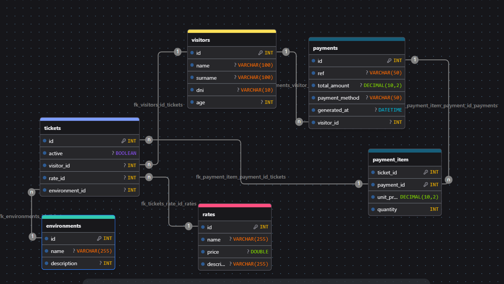

# :trophy: BIOPARK API

Los bioparques modernos han evolucionado de ser simples espacios cerrados de conservación animal a centros de exhibición biológica enfocados en la experiencia del visitante. Esta apertura al público no solo promueve la educación ambiental, sino que constituye el pilar económico fundamental para la recaudación de fondos y venta de tickets destinados a la manutención integral del parque.

- **Tarifas Rigidas:** Incapacidad para ajustar dinámicamente las tarifas de los tickets según la demanda, el tipo de visitante o las restricciones operativas de los entornos en un momento dado, limitando el potencial de recaudación para la manutención del parque.
- **Ineficiencia en control de aforos:** la operación comercial (venta de boletos,  flujos de caja).
- **Riesgo Operativo y Logístico:** Falta de trazabilidad en la asignación de personal calificado (empleados, supervisores) a hábitats específicos, lo que puede derivar en negligencias.

## 💡 Propuesta de Solución

Desarrollar una **API REST robusta, escalable y modular** que cumpla con las necesidades del proyecto:

## 🚀 Modelo de Entidades (Módulo Comercial)

- __visitors (Visitantes):__ Registro centralizado de los datos demográficos y de contacto de los clientes.
- __rates (Tarifas):__ Matriz de precios configurables basada en categorías de acceso (Bronce, Plata, Oro, Diamante) y temporadas.
- __payments (Pagos):__ Registro auditable de las transacciones financieras (monto, método de pago, estado de la transacción, comprobante).
- __tickets (Entradas):__ Credenciales digitales únicas asociadas a un visitante que validan su derecho de ingreso y controlan el aforo.
- __environments (Entornos/Atracciones):__ Catálogo de los hábitats o áreas físicas del bioparque (ej. Selva Tropical, Aviario de Madagascar) que reciben público.

## 🔗 Relaciones entre Entidades (Derivadas del Diagrama)

- __visitors-payments (Uno a Muchos):__ Un visitante puede realizar múltiples transacciones financieras a lo largo del tiempo, pero cada pago pertenece estrictamente a un único visitante.
- __payments-tickets (Uno a Muchos):__ Una sola transacción de pago puede liquidar la compra de una o varias entradas (ej. una compra familiar).
- __rates-tickets (Uno a Muchos):__ Una tarifa específica se aplica a múltiples entradas emitidas, pero cada entrada está regida por una sola estructura de precios.
- __environments-tickets ( Uno a Muchos ):__ Si un ticket da acceso a una atracción específica, la relación es de muchos tickets a un entorno.